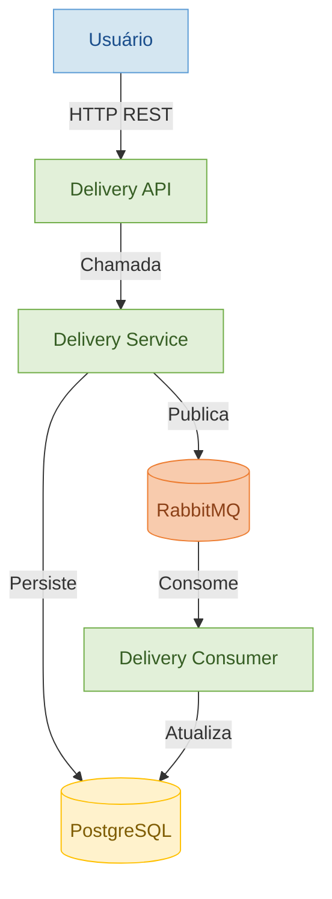

# 🚚 Delivery System

Sistema de gerenciamento de entregas com arquitetura modular em Java utilizando Spring Boot. O projeto simula a criação e processamento de pedidos com comunicação assíncrona via RabbitMQ.

## 🔧 Tecnologias utilizadas

- Java 17 + Spring Boot 3
- Maven multi-module
- PostgreSQL
- RabbitMQ (mensageria)
- Docker + Docker Compose
- Lombok
- JPA / Hibernate

## 🧱 Estrutura de Módulos

| Módulo | Função |
|--------|--------|
| `delivery-api` | Camada de apresentação (REST API) |
| `delivery-service` | Regras de negócio e persistência de dados |
| `delivery-consumer` | Consumo de eventos via RabbitMQ |

### 🧠 Arquitetura (Diagrama C4)




## 📦 Subindo o projeto

```bash
# subir banco e mensageria
docker compose up -d

# compilar tudo
mvn clean install

# rodar módulo de API
cd delivery-api
mvn spring-boot:run
```

---

Desenvolvido por Luis Felipe · [LinkedIn](https://www.linkedin.com/in/luis-felipe-contrate/)
