# 🚚 Delivery System

Sistema de gerenciamento de entregas com arquitetura modular em Java utilizando Spring Boot. O projeto simula a criação e processamento de pedidos com comunicação assíncrona via RabbitMQ.

## 🔧 Tecnologias utilizadas

- Java 17 + Spring Boot 3
- Maven multi-module
- PostgreSQL
- RabbitMQ (mensageria)
- Docker + Docker Compose
- Lombok
- JPA / Hibernate

## 🧱 Estrutura de Módulos

| Módulo | Função |
|--------|--------|
| `delivery-api` | Camada de apresentação (REST API) |
| `delivery-service` | Regras de negócio e persistência de dados |
| `delivery-consumer` | Consumo de eventos via RabbitMQ |

### 🧠 Arquitetura (Diagrama C4)

```mermaid
graph TD
    %% Estilos com cores de texto
    classDef user fill:#d4e6f1,stroke:#5b9bd5,color:#1a4e8c
    classDef component fill:#e2f0d9,stroke:#70ad47,color:#365e24
    classDef queue fill:#f8cbad,stroke:#ed7d31,color:#8c4118
    classDef database fill:#fff2cc,stroke:#ffc000,color:#7e5c03
    
    %% Elementos
    User[Usuário]:::user
    API[Delivery API]:::component
    Service[Delivery Service]:::component
    DB[(PostgreSQL)]:::database
    MQ[(RabbitMQ)]:::queue
    Consumer[Delivery Consumer]:::component
    
    %% Fluxo
    User -->|HTTP REST| API
    API -->|Chamada| Service
    Service -->|Persiste| DB
    Service -->|Publica| MQ
    MQ -->|Consome| Consumer
    Consumer -->|Atualiza| DB
```




## 📦 Subindo o projeto

```bash
# subir banco e mensageria
docker compose up -d

# compilar tudo
mvn clean install

# rodar módulo de API
cd delivery-api
mvn spring-boot:run
```

---

Desenvolvido por Luis Felipe · [LinkedIn](https://www.linkedin.com/in/luis-felipe-contrate/)
